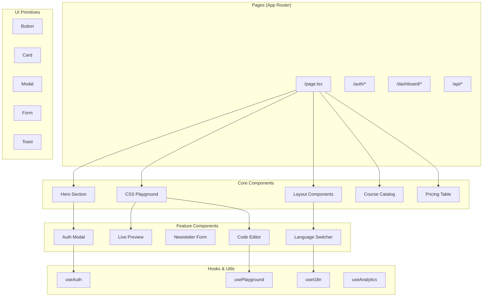
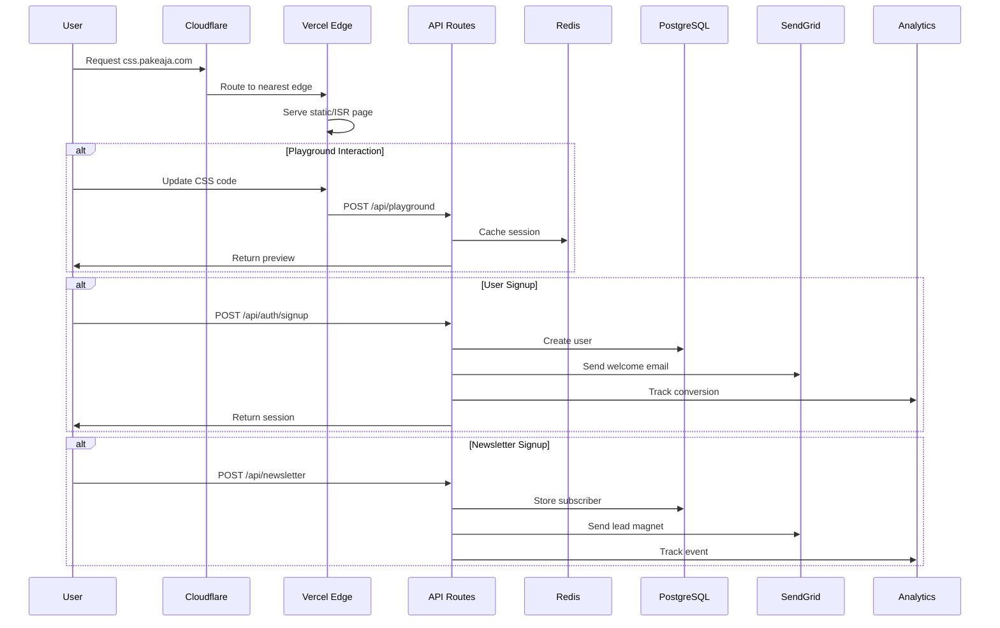
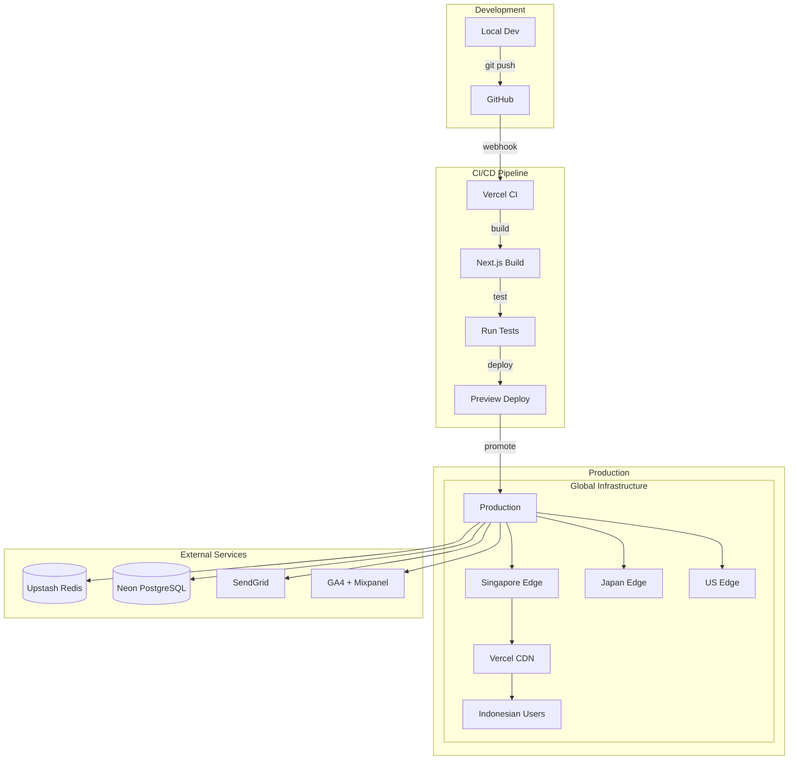

# Architecture Design: CSS.pakeaja.com Platform

## 1. Recommended Tech Stack

### Frontend Layer
```yaml
Framework: Next.js 14 (App Router)
  Rationale:
  - React-based as requested
  - Excellent Vercel integration
  - Built-in performance optimizations
  - Server Components for SEO
  - Edge runtime support for Indonesia

Styling: Tailwind CSS v3
  Rationale:
  - Utility-first aligns with CSS learning theme
  - Excellent performance (no runtime)
  - Easy to demonstrate CSS concepts
  - Mobile-first by default
  - Small bundle size with PurgeCSS

UI Components: Radix UI + Custom
  Rationale:
  - Unstyled, accessible primitives
  - Pairs perfectly with Tailwind
  - Allows custom CSS demonstrations
  - Lightweight and performant

Code Editor: CodeMirror 6
  Rationale:
  - Lighter than Monaco Editor
  - Better mobile support
  - Extensible for CSS features
  - Tree-shakeable
```

### Backend Layer
```yaml
API: Next.js API Routes (Edge Functions)
  Rationale:
  - Serverless by default on Vercel
  - Edge runtime for low latency
  - TypeScript support
  - Integrated with frontend

Database: Upstash Redis + PostgreSQL (Neon)
  Rationale:
  - Redis for sessions, rate limiting
  - PostgreSQL for user data
  - Both are serverless
  - Global replication available
  - Pay-per-use pricing

Authentication: NextAuth.js v5
  Rationale:
  - Seamless Next.js integration
  - Multiple providers (Email, Google)
  - Edge-compatible
  - Session management built-in
```

### Infrastructure & Services
```yaml
Hosting: Vercel
  - Already configured
  - Edge Network in Singapore
  - Automatic scaling
  - Built-in analytics

Email: SendGrid
  - Indonesian IP reputation
  - Template management
  - Event webhooks
  - Good deliverability

Analytics:
  - Google Analytics 4 (user behavior)
  - Mixpanel (product analytics)
  - Vercel Analytics (performance)

Payment: Xendit (Phase 2)
  - Indonesian payment methods
  - E-wallet support
  - Virtual accounts
  - Recurring billing

Storage: Vercel Blob Storage
  - User avatars
  - Course assets
  - Global CDN
  - S3-compatible API
```

## 2. Component Architecture



### Component Structure
```typescript
src/
├── app/
│   ├── (marketing)/
│   │   ├── page.tsx              // Homepage
│   │   └── layout.tsx
│   ├── (auth)/
│   │   ├── login/page.tsx
│   │   ├── signup/page.tsx
│   │   └── layout.tsx
│   ├── api/
│   │   ├── auth/[...nextauth]/route.ts
│   │   ├── newsletter/route.ts
│   │   └── playground/route.ts
│   └── layout.tsx               // Root layout
├── components/
│   ├── ui/                      // Radix + Tailwind primitives
│   ├── sections/               // Page sections
│   ├── features/              // Feature components
│   └── layouts/              // Layout components
├── lib/
│   ├── auth/                 // Auth utilities
│   ├── db/                  // Database clients
│   ├── email/              // Email templates
│   └── analytics/         // Analytics helpers
├── hooks/                 // Custom React hooks
├── styles/               // Global styles
└── locales/             // i18n files
```

## 3. Data Flow Architecture



### Data Models
```typescript
// User Model (PostgreSQL)
interface User {
  id: string
  email: string
  name?: string
  passwordHash?: string
  provider: 'email' | 'google'
  languagePreference: 'id' | 'en'
  subscription: {
    status: 'free' | 'premium'
    validUntil?: Date
    xenditCustomerId?: string
  }
  metadata: {
    source: string
    referrer?: string
    createdAt: Date
    lastLogin: Date
  }
}

// Session Model (Redis)
interface Session {
  userId: string
  playgroundState?: {
    html: string
    css: string
    lastModified: Date
  }
  preferences: {
    language: 'id' | 'en'
    theme: 'light' | 'dark'
  }
}

// Newsletter Subscriber (PostgreSQL)
interface Subscriber {
  id: string
  email: string
  language: 'id' | 'en'
  tags: string[]
  leadMagnetSent: boolean
  createdAt: Date
  source: {
    utm_source?: string
    utm_medium?: string
    utm_campaign?: string
  }
}
```

## 4. Deployment Architecture



### Environment Configuration
```bash
# .env.local (Development)
NEXT_PUBLIC_APP_URL=http://localhost:3000
DATABASE_URL=postgresql://...
REDIS_URL=redis://...
NEXTAUTH_SECRET=...
SENDGRID_API_KEY=...
GOOGLE_ANALYTICS_ID=...
MIXPANEL_TOKEN=...

# Vercel Environment Variables (Production)
# Same as above but with production values
# Automatically injected at build time
```

## 5. Security Considerations

### Application Security
```yaml
Authentication:
  - NextAuth.js with secure sessions
  - CSRF protection built-in
  - Rate limiting on auth endpoints
  - Password hashing with bcrypt
  - OAuth state validation

Authorization:
  - Role-based access (free/premium)
  - API route middleware
  - Resource-level permissions

Data Protection:
  - All data encrypted in transit (HTTPS)
  - Database encryption at rest
  - PII minimization
  - GDPR compliance tools

Input Validation:
  - Zod schemas for all inputs
  - SQL injection prevention (Prisma)
  - XSS protection (React)
  - CSP headers configured
```

### Infrastructure Security
```yaml
Network:
  - Cloudflare DDoS protection
  - Vercel firewall rules
  - IP allowlisting for admin

Secrets Management:
  - Environment variables in Vercel
  - No secrets in code
  - Rotation reminders
  - Audit logging

Monitoring:
  - Sentry error tracking
  - Uptime monitoring
  - Security headers check
  - Dependency scanning
```

### Playground Security
```yaml
Code Execution:
  - CSS-only sandbox
  - No JavaScript execution
  - Content Security Policy
  - iframe sandboxing

Rate Limiting:
  - 100 requests/minute per IP
  - 10 playground saves/hour
  - Redis-based counting

Resource Limits:
  - Max 10KB CSS code
  - 5 second execution timeout
  - Memory usage caps
```

## 6. Scalability Plan (10,000 Users)

### Phase 1: Launch (0-1,000 users)
```yaml
Infrastructure:
  - Single Vercel project
  - Shared PostgreSQL (Neon free)
  - Upstash Redis free tier
  - Basic monitoring

Optimizations:
  - Static homepage
  - 5-minute ISR for dynamic
  - CloudFlare caching
  - Image optimization

Cost: ~$0-20/month
```

### Phase 2: Growth (1,000-5,000 users)
```yaml
Infrastructure:
  - Vercel Pro plan
  - Neon Pro database
  - Upstash pay-as-you-go
  - Enhanced monitoring

Optimizations:
  - Database indexing
  - Query optimization
  - Redis caching layer
  - CDN for assets

Features:
  - User dashboards
  - Saved playgrounds
  - Email automation
  - A/B testing

Cost: ~$100-200/month
```

### Phase 3: Scale (5,000-10,000 users)
```yaml
Infrastructure:
  - Vercel Enterprise
  - Database replication
  - Multi-region Redis
  - Full observability

Optimizations:
  - Database read replicas
  - Aggressive caching
  - Edge computing
  - Background jobs

Features:
  - Premium subscriptions
  - Video content
  - API access
  - Mobile apps

Cost: ~$500-1000/month
```

### Performance Targets by Phase
```yaml
Phase 1:
  - 99.9% uptime
  - <3s page load
  - 100 concurrent users

Phase 2:
  - 99.95% uptime
  - <2s page load
  - 500 concurrent users
  - Database connection pooling

Phase 3:
  - 99.99% uptime
  - <1.5s page load
  - 1000 concurrent users
  - Auto-scaling enabled
```

### Database Scaling Strategy
```sql
-- Indexing Strategy
CREATE INDEX idx_users_email ON users(email);
CREATE INDEX idx_sessions_user_id ON sessions(user_id);
CREATE INDEX idx_subscribers_created ON subscribers(created_at);

-- Partitioning (Phase 3)
-- Partition playground_saves by month
-- Archive old sessions
-- Separate read/write connections
```

### Caching Strategy
```typescript
// Cache Layers
1. Browser Cache: Static assets (1 year)
2. CDN Cache: Images, CSS, JS (1 week)
3. Redis Cache: Sessions, playground state (1 hour)
4. Application Cache: Course data (5 minutes)
5. Database Cache: Query results (1 minute)

// Cache Keys
user:session:{userId}
playground:state:{sessionId}
courses:list:{language}
newsletter:subscriber:{email}
```

## Monitoring & Observability

### Key Metrics to Track
```yaml
Business Metrics:
  - Signup conversion rate
  - Newsletter subscription rate
  - Playground engagement time
  - Course preview clicks
  - Premium upgrade rate

Technical Metrics:
  - Core Web Vitals (LCP, FID, CLS)
  - API response times
  - Database query performance
  - Error rates by endpoint
  - Cache hit rates

Infrastructure Metrics:
  - Edge function invocations
  - Bandwidth usage
  - Database connections
  - Redis memory usage
  - Email delivery rates
```

### Alerting Strategy
```yaml
Critical Alerts:
  - Site down (ping monitor)
  - API errors >5%
  - Database connection failures
  - Payment webhook failures

Warning Alerts:
  - Response time >3s
  - Cache hit rate <80%
  - Disk usage >80%
  - Failed email deliveries

Info Alerts:
  - New user milestone
  - Traffic spike detected
  - Deployment completed
```

---
Last Updated: 2025-07-08